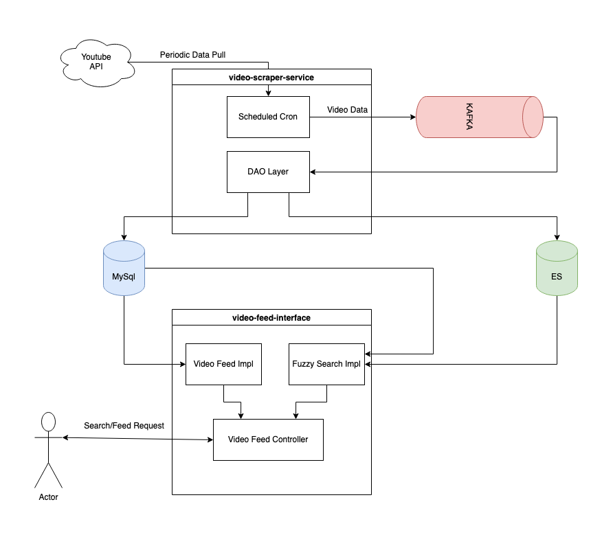

# fampay-youtube-assignment

## Problem Statement
To make an API to fetch the latest videos sorted in reverse chronological order of their publishing date-time from YouTube for a given tag/search query in a paginated response.
### Goals
- Server should call the YouTube API continuously in background (async) with some interval (say 10 seconds) for fetching the latest videos for a predefined search query and should store the data of videos (specifically these fields - Video title, description, publishing datetime, thumbnails URLs and any other fields you require) in a database with proper indexes.
- A GET API which returns the stored video data in a paginated response sorted in descending order of published datetime.
- A basic search API to search the stored videos using their title and description.
- Dockerize the project.
- It should be scalable and optimised.
### Bonus Goals
- Add support for supplying multiple API keys so that if quota is exhausted on one, it automatically uses the next available key.
- Make a dashboard to view the stored videos with filters and sorting options (optional)
- Optimise search api, so that it's able to search videos containing partial match for the search query in either video title or description.
    - Ex 1: A video with title *`How to make tea?`* should match for the search query `tea how`

## Technology Used
- Spring Boot (For implementation of MVC and using @Scheduled as cron)
- Spring Web Flux (Used for read api, WebFlux being a non thread blocking architecture optimises high throughput read operations) 
- MySql (For Storing Video Details and for indexing helping in optimising paginated queries)
- Kafka (To decouple the logic of saving data in mysql and elasticsearch making sure the thread running the scheduled task is not blocked for long, also to provide idempotency in writing data to data stores using the partition key of kafka, will help if multiple instances of same application are deployed)
- ElasticSearch (For storing the columns and creating index on videoTitle and videoDescription allowing fuzzy search capabilities on the same)

## How To run the application
### Prerequisites
- Maven
- Docker
- bash/zsh shell
### Instructions to start application
Navigate to root folder of the project and follow the following steps after insuring the above mentioned prerequisites are already installed on the system.
S1) In the .env file add all the available youtube api keys in a comma separated manned for the variable *YOUTUBE_KEY*
```
YOUTUBE_KEY=KEY1,KEY2,KEY3
```
S2) *OPTIONAL* Set the desired password for mysql in .env(DB_PASS) and docker-compose.yml under the db service (MYSQL_ROOT_PASSWORD)
S3) Enter the following command in the root folder of the project. You can monitor the progress on docker desktop dashboard.
```bash
bash start.sh
```
Note: ElasticSearch takes about 2 mins to start (observed on my system with just 8gb ram) till then the java applications might reastart, but as soon as elastic search is up the system stabilizes.

### Instruction to stop application
Run the command given below in the root directory of the project.
```bash
docker compose down
```

### Swagger
Swagger 3 is integrated in the project as an alternative to a dashboard, making it easier to review Dtos and Apis.
You can also check all the schemas used under the schema tab.
[Link To Swagger](http://localhost:8010/webjars/swagger-ui/index.html#/) 
Controller: video-feed-controller
- Video Feed Api (/feed) In this api cursor pagination is implemented
  - size : integer parameter, pass the size of entries to be requested in the page
  - cursor: dateTime parameter, leave it empty to fetch the initial page, in the api response a dto field *pageCursor* will be returned, pass it as it is in the same api to request the next page with the given size.
- Fuzzy Search Api (/search) 
  - size : integer parameter, the no of entries to be returned of the search.
  - query : string parameter, the query string on which fuzzy search is to be performed.

## Solution Arch.
The solution contains 2 microservices
- video-scraper (Responsible for fetching videos of the search parameter specified in .env under key YOUTUBE_SEARCH_QUERY, storing it in mysql and creating search index on elastic search)
- video-feed-interface (Provide paginated feed and fuzzy search apis over the datastore)
Project is broken down into 2 microservices, video-feed-interface is completely read based and video-scraper is completely write based, this is to make sure if one microservice is down the other functionality is still up and remains unaffected)

### Service Diagram


### Further Optimisations
- In an environment where multiple instances of the same application is deployed, Spring @Scheduled tasks are not a good implementation of cron, there are 2 alternatives for the same
  - Bind the video fetch and store process behind an API and let a linux cron / Rundeck utility can invoke the API exposed over a loadbalancer so the load is distributed and the invocation is same as the cron defined and not he multiple of the pods deployed.
  - A workflow utility like temporal can be used to create this cron workflow, it will use the inbuilt scheduler to do the task, this could be an overkill just for cron purpose.
- In docker-compose config, a custom health check can be implemented for elastic search and a dependency can be configured on the rediness/liveness of the elasticsearch cluster over the java images so its is not started until the es cluster is up and multiple restarts of the services can be avoided.
- In a distributed environment the stack of api keys can be maintained over redis so if a key expires in one instance and removed from the stack the same is propagated to all the other instances, instead of each pod maintaining their copy of api key stack.